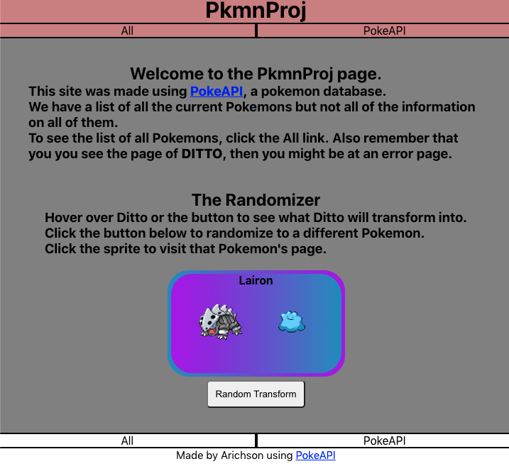
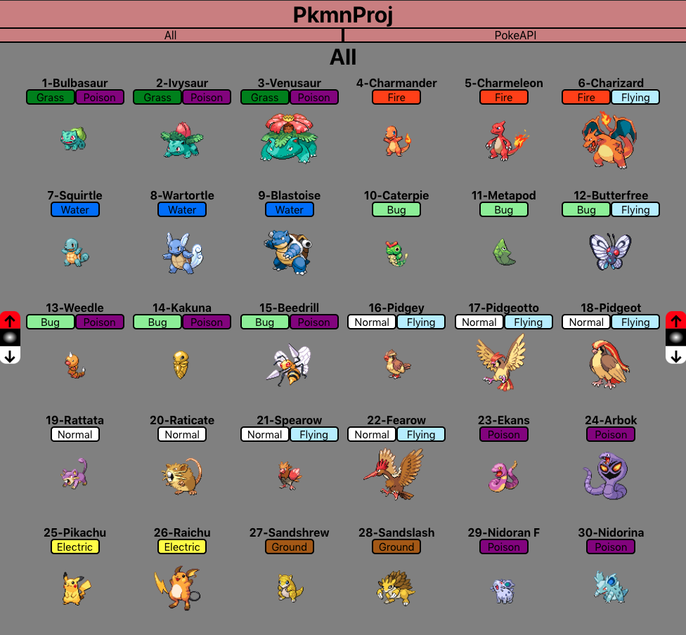
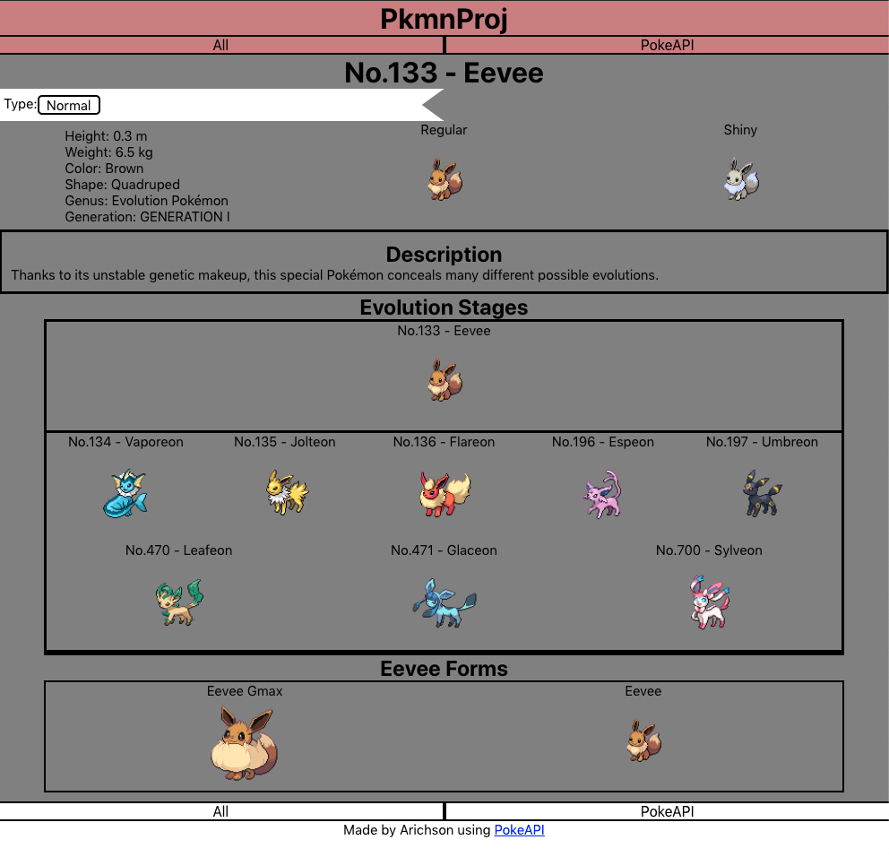

# PKMNPROJ
## Website Description

This website was made to provided a list of Pokemons with the help of PokeApi. The website will allow users to scan through the pages and look at all the different species of Pokemons. The website is mostly a Pokedex, meaning that it will not provided information about the games but rather just on the Pokemon themselves.
 

[PkmnProj](https://arichson.github.io/PkmnProj/)

## Getting Started/ Installations
#### Website Features
- Whole Site 
    - Links to the homepage and the page that contains the list of Pokemons
    - A link to the Api used
    - Color changes upon hovering over clickable items
     
- Home Page
  
    - Hover over the sprites to show their Shiny form 
        - Created by changing the source image on mouse enter/leave
    - Button that randomizes what Pokemon you see 
        - Created with mathRandom and fetching data corresponding to the number
     
- Pokemon List Page 
  
    - Links that takes users to individual Pokemon pages
    - Hover over the sprites to show their Shiny form 
        - Created by changing the source image on mouse enter/leave
    - Auto scroll button that scrolls to top, middle, and bottom of the page
        - Created by using window.Scroll() 
     
- Individual Pokemon Pages 
  
    - Page contains general information about the Pokemon and their evolutions
    - Hover over the different forms to show their Shiny form 
        - Created by changing the source image on mouse enter/leave

## Technologies Used
- React: Routers, Links, export functions
- JavaScript: math methods/randomization, array methods, callback, Api data
- CSS Modules, Responsive Design

## Available Contributions To Be Made
##### All Contributions are optional
- [ ] Fix up evolution functions, if there is a better 
- [ ] Better CSS design
- [ ] Additional Pokemon information
- [ ] Additional pages for game informations
- [ ] Any interesting ideas

